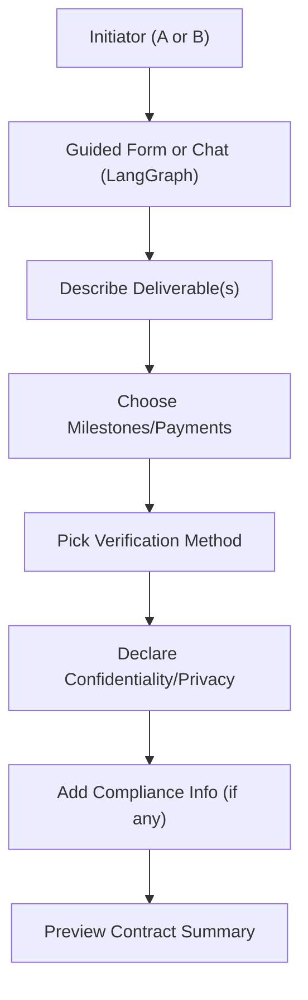
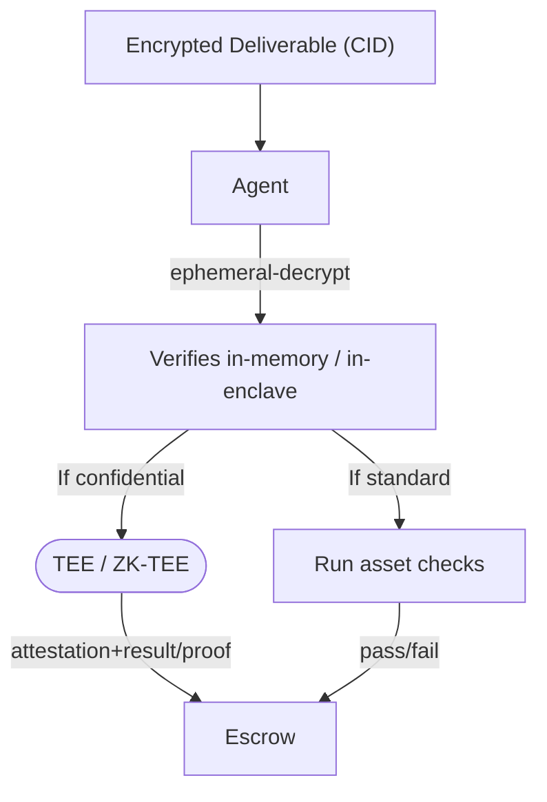
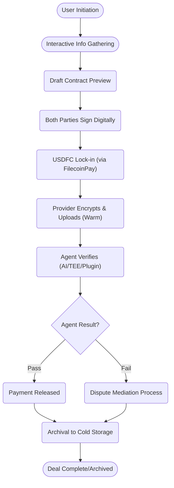

***

# DocPact Technical Architecture: End-to-End Breakdown

***

## 1. 🌐 **User & Info Gathering Flow**

### 1.1 Entry, Information Collection & Agreement Draft

**Who can start?**  
- *Either party*: client, creator, legal, business.
- No login—**wallet-based onboarding** (MetaMask, WalletConnect, etc).

**Info Collected:**
- What is being exchanged?  
  _e.g. codebase, document, design, access key_
- What are the milestone(s) and payment splits?
- Are there **special privacy/confidentiality needs**? (e.g. legal doc vs. portfolio image)
- What verification agent is required?
- Are there jurisdiction-specific compliance requirements?

***

### 🖼️ **Visual: Data Collection & Setup (Markdown Diagram)**



- All input flows through LangGraph nodes, which interactively adapt follow-up questions based on previous answers.
- _Minimal code example:_
```typescript
const { input, deliverable, milestones, verification, privacy, compliance } = userInput();
```

***

## 2. 📝 **Contract Finalization & Digital Execution**

**Contract Drafting:**
- DocPact agent merges user input into a multi-section, human-readable contract (NDA if toggled; milestones itemized).

**Review Mode:**
- Both parties view in “plain English” and can toggle to technical view (on Next.js).

**Digital Signatures:**
- EIP-712 typed data signing.
- Parties sign sequentially or in parallel—every signature is onchain and timestamped.
- Each signature is directly linked to wallet and contract version for audit.

**Multi-party Support:**
- Every required party, or admin agent, may sign in round-robin or in parallel.

##### 🔑 **Signature Status (“At a Glance” Table)**

| Party           | Wallet Address   | Signed?   | Timestamp           |  
|-----------------|-----------------|-----------|---------------------|  
| Client          | 0x123...abc      | ✔         | 2025-09-05 19:45    |  
| Creator         | 0x789...xyz      | ⏳        |                     |  

***

## 3. 💸 **Escrow Creation, Fee Lock, and Storage Estimation**

**SDKs/Smart Contracts Used:**
- [@filoz/synapse-sdk/PaymentsService](https://www.npmjs.com/package/@filoz/synapse-sdk)
- [FilecoinPay](https://github.com/FilOzone/filecoin-pay) escrow contract suite.

**Steps:**
1. Calculate/estimate storage (automatically suggested, but user editable).
2. Calculate platform/agent fees (shown on UI).
3. User(s) sign and initiate payment to escrow (USDFC or other FEVM-supported tokens).

##### **Escrow Deposit Confirmation Table**

| Item            | Amount           | Notes                    |
|-----------------|-----------------|--------------------------|
| Milestone #1    | $1,000           | Due after phase 1 pass   |
| Milestone #2    | $1,000           | ...                      |
| Milestone #3    | $1,000           | ...                      |
| Agent Fees      | $45              | Verification phase       |
| Storage Buffer  | $2               | Warm + cold, estimate    |
| Total           | $3,047           |                          |

***

## 4. 🔐 **Asset Submission and Cryptographic Storage**

**Deliverables Submission:**
- Providers never upload raw files—**AES/ChaCha-encrypted** (using [crypto](https://developer.mozilla.org/en-US/docs/Web/API/Crypto), [libsodium](https://github.com/jedisct1/libsodium.js)) in browser.
- Chunked uploads for large repos/media.
- Immediate **warm storage upload** via `createStorage({ withCDN: true })`. When completed, **auto-archival to Filecoin cold storage** (permanent).

**All uploads are referenced with CIDs onchain** via the EscrowDealMaker contract.

##### 🗃️ **Assets in This Deal**

| Phase   | CID                    | Storage Tier | Encryption | Verified? |
|---------|------------------------|--------------|------------|-----------|
| Phase 1 | bafybeib...            | Warm + Cold  | Yes        | ⏳        |

***

## 5. 🤖 **Agent Verification: Review, Privacy Checks, and TEE Escalation**

**Verification agent (AI or plugin) gets auto-notified.**
- Fetches encrypted CID from Filecoin.
- Decryption requires ephemeral, isolated agent context.

**Normal Checks:**
- Runs standard tasks (code test, hash check, document scan) in memory and releases pass/fail/proof to escrow contract.

**Confidential/TEE/Zero-Knowledge-TEE**
- If flagged confidential, agent runs in **TEE enclave** (SGX/Nitro/Conclave).
- ZK proof support: For asset claims (e.g., _"file passes test suite X"_) **without content leak**.

-----  
#### 🖼️ **Diagram: Verification Privacy Route**


-----

##### **Agent Result Example (JSON)**

```json
{
  "phase": 1,
  "outcome": "pass",
  "proof": "ZK-snark-proof-hash",
  "agent_attestation": "0xagentSignature",
  "verifier": "AI:CodeCheck-v1 (in TEE)",
  "timestamp": "2025-09-05T22:19:12Z"
}
```

***

## 6. 👛 **Milestone Approval, Payment, and Key Handover Workflow**

**On successful verification:**
- Milestone payment released from escrow (via FilecoinPay/SDK).
- If all verified, final phase decrypt key is sent to client (who can now decrypt their files).
- If any phase fails, parties are auto-notified for mediation or dispute; possible fallback to a human/agent arbiter.

***

## 7. 🔒 **Audit Logging, Cold Storage, and Onchain Proof**

- **Every event**—signature, upload, AI check, TEE attestation, payment, handover—is logged as an onchain contract event and optionally Merkle-proved offchain.
- On full agreement completion, assets and logs **archived to Filecoin cold storage.**
- Transparency: Anyone with deal/cid can verify—prevents "he said, she said".

***

## 8. 🧩 **All Technology Stack Locations**

- **Frontend:** Next.js + Tailwind, Ethers.js for wallet ops, all encryption in-browser.
- **Agent Middleware:** LangGraph for orchestration, pluggable custom nodes (TS/JS).
- **Backend/Serverless:** Next.js API routes, calls SynapseSDK (Payments, Storage).
- **Smart Contracts:** FEVM, FilecoinPay suite, custom EscrowDealMaker (handles all funds, CIDs, agent attestations, state).
- **Storage:** SynapseSDK (warm/cold), Filecoin direct.
- **Confidential Verification:** TEE runtime (SGX/AWS Nitro/Oasis/Conclave), optionally ZK circuits.
- **Compliance/Timestamps:** All actions logged on FEVM and, if required, synchronized with compliance APIs (future).

***

## 9. **Example: Realistic Escrow Agreement Lifecycle (with major Signposts and Actor View)**



***

## 10. **UX "Snapshots" for Every Core Step**

**A. Contract Preview/Signature:**
```
-----------------------------------------------------
 Digital Agreement Summary
-----------------------------------------------------
- Client: 0x123...
- Creator: 0x456...
- Asset: Project Repo (encrypted, 42MB)
- Milestones: [Phase 1: $1,000][Phase 2: $1,000][Phase 3: $1,000]
- Verification: AI-Agent (in TEE)
- Confidential: Yes, phases 2/3 only
---> E-SIGN / VIEW IN TECHNICAL MODE <---
-----------------------------------------------------
```

**B. Milestone Progress:**
```
-----------------------------------------------------
 [✓] Contract Signed
 [✓] Funds Locked
 [✓] Phase 1 Submission (CID: baf...)
 [✓] Agent Verified (Proof: 0x...)
 [✓] Phase 1 Payment Released
 [ ] Phase 2...
-----------------------------------------------------
```

***

This full architecture.md is ready for both teams and developers—**richly annotating every technical, UX, privacy, and contract detail.**  
