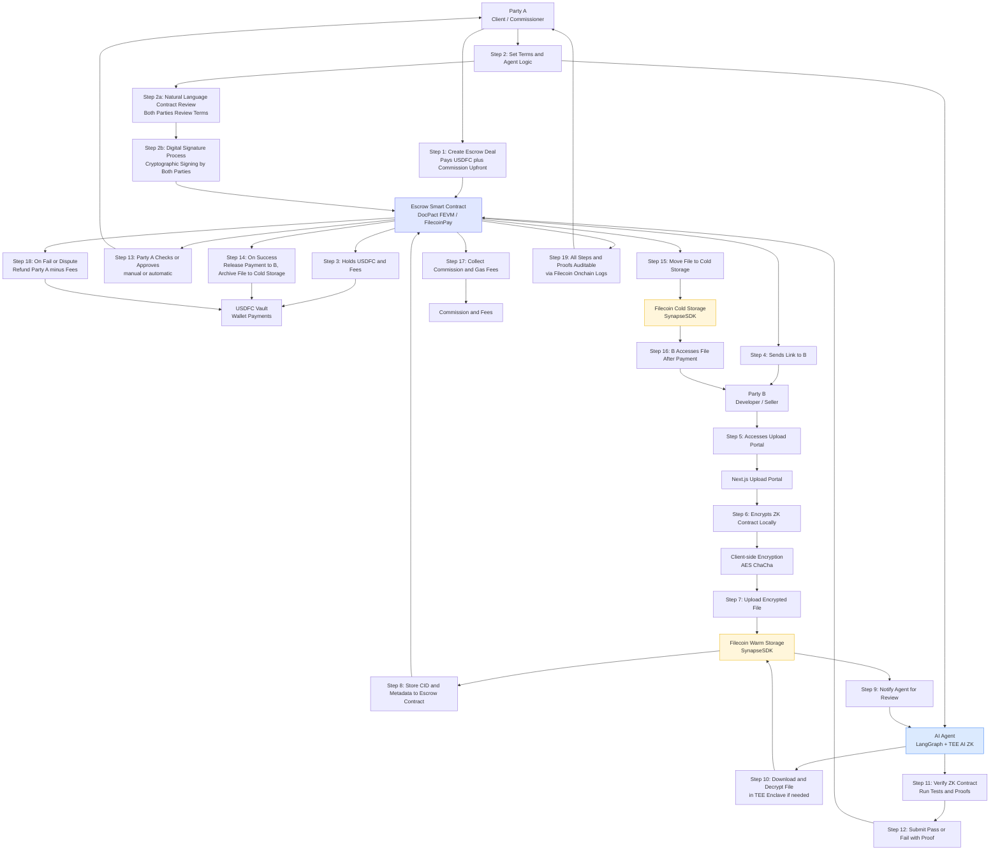

***

> **📋 Technical Architecture:** For detailed technical implementation, system design, and architecture documentation, see [ARCHITECTURE.md](./ARCHITECTURE.md)

***

# DocPact: A Decentralized, Agent-Driven Trust Layer for Secure Digital Exchange

***

## 🌟 Executive Summary

DocPact is a Filecoin-powered, AI-mediated, and privacy-preserving “digital third party” for secure, verifiable, and flexible digital asset exchange. It lets creators, teams, businesses, and organizations exchange code, designs, keys, media, documents, or any valuable digital content without requiring trust in counterparties or platform operators. With programmable onchain payments, cryptographic storage, agent-verified execution, and full auditability, DocPact brings flexible, open collaboration to the Filecoin Onchain Cloud.

***

## 1. The Problem: Systemic Barriers in the Modern Digital Creative Economy

Despite a global surge in digital collaboration across writing, law, design, video, prompt engineering, art, and technical work, those **actually driving the future of knowledge and creativity are underserved by the very platforms meant to empower them. Key failures persist:**

### **Endemic Non-Delivery, Disputes & Loss of Income**
- **Global gig and creative platform users (writers, engineers, lawyers, designers, video editors, AI artists, template creators, and more)** lose billions yearly to non-payment, fake deliverables, "friendly fraud," and unresolved disputes.
- **Verified Statistics:** In 2024, India alone suffered **₹22,845 crore ($2.7 billion)** in cyber fraud losses, representing a 206% increase from the previous year <mcreference link="https://timesofindia.indiatimes.com/business/cybersecurity/indias-cyber-fraud-epidemic-rs-22845-crore-lost-in-just-a-year-206-jump-from-previous-year-says-government/articleshow/122840099.cms" index="1">1</mcreference>. Research shows that **51% of freelancers have experienced wage theft at least once**, with 44% believing this occurs because freelancers are not taken seriously <mcreference link="https://www.statista.com/topics/4891/gig-economy-in-the-us/" index="2">2</mcreference>.
- **Scale of Impact:** With 64 million Americans doing freelance work (38% of the workforce) contributing $1.27 trillion to the U.S. economy annually <mcreference link="https://www.upwork.com/resources/gig-economy-statistics" index="3">3</mcreference>, even small percentages of fraud represent massive losses.
- *Trust is routinely eroded.* There is no objective, tamper-proof way to prove what was delivered, when, by whom, or whether the terms were fulfilled—resulting in endless cycles of suspicion and wasted effort.

### **No Flexible, Programmable Contract Layer**
- Most current agreements are generic templates or locked to centralized platforms with rigid rules. Custom flows—like staged payments, royalty splits for joint works, milestone-based handover, or group commissions—require costly legal work or are impossible for individuals and emerging teams.
- *No ordinary creator or business can easily launch, enforce, or audit digital contracts that truly match the shape and creativity of their work.*

### **Opaque Workflows and Costly Platform Silos**
- Marketplaces extract **10–20%+ in fees**, lock users into proprietary data flows, and stifle innovation that doesn't match their vertical.
- Critical parties—prompt engineers, collaborative researchers, novel content creators—lack a unified, open standard for fair and intelligent collaboration.

### **Missing Verifiability, Auditability, AI Checks, and Digital Privacy**
- **Phishing dominates fraud landscape:** 40% of all online fraud losses come from phishing attacks <mcreference link="https://www.zigram.tech/resources/digital-payment-fraud-statistics-2025/" index="1">1</mcreference>, while social engineering scams make up 30% of all fraud incidents globally <mcreference link="https://www.zigram.tech/resources/digital-payment-fraud-statistics-2025/" index="1">1</mcreference>
- Multi-national collaborations especially struggle: *There are no trustless, programmable payment systems that support cryptographic privacy, compliance, or enforceable contracts with verifiable e-signatures, tailored for local conditions.*

### **Programmable Trust Rails Are Missing**
- No platform today allows group or agent-based approvals; automated audit trails; blended agent (AI/human/legal) signatures; or fully private, on-chain, auditable delivery and evidence.
- New industries—prompt markets, collaborative story/game writing, decentralized IP creation, or global digital collectives—are held back by the lack of these adaptive, programmable "trust rails."

***

## 3. Solution: DocPact's Agent-Driven Programmable Digital Contract Platform

*DocPact establishes an intelligent, trustless, and privacy-first contract layer where creators, teams, and businesses in any digital field can finally work without compromise.*

### **Human-Readable Contract Creation & Natural Language Processing**
- **Conversational Contract Builder:** Users describe their needs in plain English ("I need a logo designed with 3 revisions, delivered as PNG and SVG files, payment released after approval") and DocPact automatically converts these into executable smart contracts
- **Visual Contract Designer:** Drag-and-drop interface for complex workflows, milestone mapping, and payment structures that anyone can understand
- **Plain English Summaries:** Every contract includes human-readable explanations alongside technical implementation, ensuring all parties understand terms before signing
- **Multi-language Support:** Contracts can be displayed and understood in multiple languages while maintaining technical accuracy

### **Programmable Digital Contracts for Real-World Creativity**
- **Any contract shape:** Customize payments, milestones, multi-party splits, staged asset reveals, or rolling royalties.
- **Modular templates:** Deploy legal, technical, and creative flows that adapt to your business, your country, your collaboration style.

### **AI and Human-Agent Orchestration**
- **Bring your own agents:** Plug-in AI scripts, compliance bots, or even legal reviewers to check originality, format, compliance, completion, and more—*all enforced within the actual contract, not just as an afterthought*.

### **Cryptographically Auditable, End-to-End Digital Privacy**
- All actions (uploads, reviews, approvals, handovers) are cryptographically signed, privately encrypted, and permanently logged to decentralized storage—*enforcement and review is possible in any jurisdiction without losing confidentiality*.

### **Global, Legally Sound Digital Signatures and Releases**
- Built-in **digital/e-signature workflows** support regional and global standards, ensuring every contract is legally sound, verifiable, and accepted across borders.
- **Programmable e-signatures:** Contracts and asset releases can require AI or human co-signature, dynamic multi-party signoff, or jurisdiction-specific flows.

### **No Platform Lock-In or Hidden Fees**
- Fully portable, open data and workflow logic. Low, transparent platform usage fees—no more exploitative commissions or walled gardens.

### **Open Trust Infrastructure Across All Digital Industries**
- From collaborative design, legal review, and code bounty management to encrypted eBook drops, joint patent filings, or content commissioning—*DocPact gives every digital creator and team a foundation for secure, programmable, verifiable collaboration.*

***

**DocPact transforms programmable, AI-verified, and privacy-focused digital contracts from a luxury for major enterprises into an accessible reality for everyone—from indie writers and legal techs to global creative teams and emerging prompt engineers—fueling the next evolution of the digital economy.**

***

## 3. DocPact: Platform, Protocol, and Trusted Rail

DocPact is **not** just "another freelance site." It’s an agent-driven protocol and full-stack dApp for **secure, programmable, agent-verified execution and settlement** of *any* digital asset or agreement—built for the Onchain Cloud.

### Key Goals

- **Remove blind trust:** Enable strangers or emerging collaborators to transact securely, enforced by cryptography and programmable logic.
- **Power programmable payments:** Instantly support milestone/batch/royalty splits, atomic swaps, partial payouts, and revenue sharing—no platform interference.
- **Anchor every file, proof, contract, and log** on Filecoin with encrypted, modular, and audit-ready storage, leveraging decentralized proof and payment rails.
- **Enable privacy-by-design computation:** Leverage agent plugins, including advanced Zero-Knowledge (ZK) proof support and Trusted Execution Environment (TEE)-backed AI orchestration for any level of verification and confidentiality. *This means even the agent cannot misuse or leak sensitive data during computation.*

***

## 4. Real Use Cases—Beyond Freelance

DocPact revolutionizes trust in *any* digital industry needing verifiable value and programmable payments. Examples include, but are not limited to:

- **Team-based code or design bounties:** Reward split via onchain agent-verification of git commits, doc logs, or test pass rates.
- **High-value art/logo/eBook/media delivery:** Release payment only on agent-verified, format-checked, encrypted handover (e.g., only if watermark, size, and type are correct).
- **Technical content commissioning:** Automated plagiarism, quality, or format scan, with agent/AI approval before payout.
- **Confidential business/IP or key exchange:** Multi-stage, proof-driven asset transfer; keys/proofs released only on milestone/agent-verified satisfaction; guarantees secrecy even during agent execution via enclave/TEE.
- **In-game assets, NFTs, or digital collectibles:** Secure cross-game asset swaps or unlocks on agent or group verification.
- **Social media campaign/content strategy:** Commissions for content schedules, analytics, or influencer posts—deliveries reviewed by AI/agent, payment triggered on proof.
- **Web3/DAO collaboration, audit, or voting:** Multi-sig/group outcomes, bounty payouts, and code audits released only after oracle/agent-verified conditions.
- **Zero-Knowledge (ZK) or TEE-protected verification:** Highly sensitive proofs or business logic executed inside secure enclaves—ensuring neither party nor platform nor agent can leak data, *with onchain attestation/verification*.
- **Co-authored product launches, multi-party licensing:** Staged key reveals or royalty splitting executed via flexible agent contract logic.

#### Additional Use Cases (Illustrative, NOT Exhaustive)

- Secure documentation or manual handover for a startup sale (code, API keys, legal docs)
- Encrypted eBook or training package sales with agent-verified DRM/logic
- Split royalty revenue for ongoing team contributions to digital content/research/IP
- API/paywall access, digital collectible unlocks, personalized content delivery, hackathon bounty management

***

## 5. Under the Hood: How DocPact Works (Technical Walkthrough)

### 5.1 Human-Readable Contract Creation & Initiation (A)

Party A (buyer/client) creates their agreement through DocPact's intuitive contract builder. The platform transforms complex legal and technical requirements into **human-readable, conversational contracts** that all parties can understand:

**Contract Creation Process:**
- **Natural Language Interface:** Using conversational AI powered by **LangGraph agent orchestration**, users describe their needs in plain English ("I need a logo designed with 3 revisions, delivered as PNG and SVG files, payment released after approval")
- **Smart Contract Translation:** The system automatically converts human-readable terms into executable smart contract logic while maintaining legal clarity
- **Visual Contract Builder:** Drag-and-drop interface for complex workflows, milestone mapping, and payment structures
- **Template Library:** Pre-built templates for common scenarios (freelance work, content creation, code development, legal services, creative collaborations)

**Contract Specification:**
- All deliverables, assets, and formats (code, images, docs, media, keys, or anything else)
- Milestones, splits, payment/release conditions (supports partial delivery, staged payments, group splits)
- One or more verification agents (AI, script, oracle, or human)—*each can be chosen per contract, vertical, or even for deal stages*
- Deadlines, custom fees, optional NDA/encrypted instructions via on-chain metadata
- **Digital signature requirements** and jurisdiction-specific compliance

**Contract Readability Features:**
- **Plain English Summary:** Every contract includes a human-readable summary alongside the technical implementation
- **Visual Workflow Diagrams:** Clear flowcharts showing payment triggers, milestone dependencies, and approval processes
- **Multi-language Support:** Contracts can be displayed in multiple languages while maintaining technical accuracy
- **Legal Compliance Indicators:** Real-time validation against regional legal requirements

**Natural Language Contract Signing Process:**
- **Interactive Contract Review:** Both parties can review the contract in plain English with highlighted key terms, obligations, and payment conditions
- **Digital Signature Integration:** Cryptographic signing using wallet-based digital signatures (MetaMask, WalletConnect) that are legally binding and verifiable on-chain
- **Signature Verification:** Each party's digital signature is cryptographically verified and recorded on the blockchain with timestamp and wallet address
- **Multi-Party Signing:** Support for sequential or parallel signing workflows for contracts involving multiple stakeholders
- **Signature Status Tracking:** Real-time visibility into signing progress with notifications when all required signatures are collected

> **Note:** No user account signup is forced—
  - Authentication and transaction signing is handled with **MetaMask**, **WalletConnect**, or similar EVM wallet providers.
  - Web app UI (Next.js, Tailwind CSS) delivers seamless onboarding and clear deal management.
  - **Contract Preview Mode:** Parties can review and understand all terms before signing or depositing funds.
  - **Signature Audit Trail:** Complete record of who signed what, when, and with which wallet address for legal compliance.

### 5.2 Digital Signature & Contract Execution

Once the contract terms are agreed upon in natural language, both parties proceed through a secure digital signature process:

**Technical Implementation:**
- **EIP-712 Structured Data Signing:** Uses Ethereum's typed structured data hashing and signing standard for human-readable signature requests
- **Multi-Signature Validation:** Smart contract validates that all required parties have provided valid cryptographic signatures
- **Signature Aggregation:** Combines multiple signatures into a single on-chain transaction to minimize gas costs
- **Legal Binding:** Digital signatures carry the same legal weight as handwritten signatures under eIDAS (EU) and ESIGN Act (US) regulations

**Signing Workflow:**
1. **Contract Finalization:** Both parties review the final contract terms in plain English
2. **Signature Request:** System generates structured signature requests for each party's wallet
3. **Cryptographic Signing:** Each party signs with their private key through their wallet interface
4. **On-Chain Recording:** Signatures are verified and recorded on the blockchain with immutable timestamps
5. **Contract Activation:** Once all signatures are collected, the smart contract becomes active and funds are escrowed

### 5.4 Programmable Payment/Settlement

- User deposits tokens (primarily **USDFC**, with FEVM support) into the **FilecoinPay** escrow smart contract.
- The amount can cover:
  - Transactional payouts (to sellers/contributors)
  - Agent fees (custom per Agent)
  - Protocol fee (flat or %), if chosen
  - Gas & storage buffer
- DocPact (via SynapseSDK's PaymentsService/module) pre-checks balances, handles approvals, and builds a clean onchain summary for all parties.

### 5.5 Submission and Evidence Storage (B)

- Seller/contributor authenticates and uploads deliverables using the DocPact Next.js frontend.
- **All uploads are** AES/ChaCha-encrypted *client-side*; encryption key is generated *per deal*.
- Upload pipeline uses:
  - `@filoz/synapse-sdk/StorageService` :  
    - `createStorage({ withCDN: true })` for fast, warm storage; deal assets and logs later autopushed to cold storage for perpetual access.
  - Each CID (content identifier) and metadata is logged onchain in contract state for agent and audit access.
  - For **large assets** (video, zipped repos), chunked upload + stream processing is supported.

### 5.6 Verifiable AI/Agent Review

- Agents are orchestrated through **LangGraph** (multi-agent, multi-stage orchestration framework for conversational, logic, or workflow agents).
- **AI, script, or human-based agent** (can include multiple nodes in LangGraph) receives a notification, proves identity, and fetches CIDs directly from Filecoin storage via SynapseSDK.
- Using embedded **encryption keys**, agents decrypt files **ONLY in controlled contexts**:
  - For normal flows, decrypt in isolated ephemeral containers (never stored, not accessible to agent developer).
  - For sensitive/critical verification flows—**run inside a Trusted Execution Environment (TEE)/enclave** (e.g., Intel SGX, AWS Nitro, Oasis, Conclave/Consensys):  
    - The TEE attests its hardware status and loaded code on entry, ensuring that *only* the intended verification code runs, not arbitrary/untrusted code.
    - Neither the host system, agent creators, nor anyone else can see in-memory secrets during execution.
    - Outputs are *attested*—recipient can verify TEE (or cloud provider/chain) hardware signature matches expected code hash.
- Agent runs programmable logic (file signature, test suite, watermark, plagiarism/AI check, ZK proof gen or verification, repo content matcher, asset unlock code).
- If using **ZK-proofs**:  
  - Parties can submit or generate ZK proofs within the workflow.  
  - Example: B produces ZK proof that “uploaded file matches some public hash, passes all checks” without revealing file itself.  
  - ZK proofs are verified either by agent plugins, TEE, or, in the future, onchain as ZK rollups mature.

> - **Trusted Execution Environments (TEEs or enclaves)—such as Intel SGX, AWS Nitro, Oasis, Consensys Conclave**—isolate code and data away from host OS/app, providing cryptographic attestation that secret data is only processed inside the tested enclave, and output is only released if computation is unmodified.
> - **ZK-TEE (Zero-Knowledge Trusted Execution Environment)** refers to computational processing instances where sensitive code and data are processed in isolated environments, ensuring that information is not utilized by AI agents or services for model training, addressing privacy concerns in computational processing. <mcreference link="https://www.reddit.com/r/CryptoCurrency/comments/11hmu10/zero_knowledge_proofs_vs_trusted_execution/" index="1">1</mcreference> <mcreference link="https://www.binance.com/en/square/post/2024-11-01-differences-between-zk-and-trusted-execution-environment-in-blockchain-15652592984362" index="4">4</mcreference>
> - **DocPact can compose ZK and TEE:** Host ZK proof circuits *inside* TEEs, so that even proof generation is never seen by the agent's host or network, for "defense-in-depth".

### 5.7 Payment, Disclosure, and Handover

- On agent or ZK/TEE-verified pass, the DocPact smart contract releases USDFC (via FilecoinPay or Synapse PaymentsService) to B, per contract stipulations (full, split, or staged as defined in contract/milestone logic).
- If present, the deal-specific decryption key is released to client (A); all deliverables become accessible and verifiable.
- Failure/dispute/agent or attestation failure results in protocol-triggered refund, return-to-draft, burn, or optional mediation. *All steps are logged on Filecoin for full, cryptographic audit and replay.*

### 5.8 Secure, Auditable Storage and Privacy

- **Every file, log, and contract event is pushed to Filecoin via Synapse SDK**, using decentralized proofs, audit trails, and content-addressed storage.
- **Filecoin's ZK-SNARK implementation** is specifically designed for storage verification (Proof of Replication and Proof of Spacetime), generating 6-7 million proofs daily to verify storage integrity. <mcreference link="https://filecoin.io/blog/posts/zero-knowledge-and-the-filecoin-network/" index="1">1</mcreference> ZK-TEE computational processing integrates with Filecoin's storage layer through compatible tools and frameworks.
- Blockchain event logs + offchain Merkle proofs anchor every workflow; *no lost evidence or "he said, she said"—all deal artifacts verifiable anytime*.
- **Client-driven encryption** always, with one-time or agent/TEE-scoped decryption—**no agent or storage provider ever sees confidential data unless contracted and attested for that session**.

### 5.9 Detailed Integration & Full Stack — Packages, SDKs, and Agent Architecture

**Front End & Back End:**  
- `next`, `react`, `typescript`, and `tailwindcss`: Unified SSR/CSR dApp for onboarding, dashboards, API routes (private/public endpoints), agent triggers, admin interfaces.
- All API flows (deal creation, file upload, agent triggers, key disclosures) orchestrated with Next.js serverless endpoints for security and performance.

**Agent Orchestration:**  
- `langgraph`: All DocPact agent code/automation runs as composable graphs—handle multi-node, multi-stage, and conditional flows; supports agent-to-agent, agent AI to human review, and agent to TEE/Conclave.
- Pluggable module support for ZK-proof checkers, TEE/conclave calls, and oracle integrations.
- AI API calls (optional): Allow decentralized/3rd party LLM APIs (e.g., Bittensor, Gensyn) for advanced content evaluation (run in ephemeral or TEE-protected env).

**Filecoin/Onchain Cloud:**  
- `@filoz/synapse-sdk` (StorageService, PaymentsService, Pandora/PDP, CommP utilities): Everything from encrypted upload to retrieval, programmable cost estimation, and modular payment flows.
- All Filecoin/FEVM interactions (wallet auth, payment/approval, contract agent triggers, event logging) using EVM-compatible tools.
- `filecoinpay` contract libraries for onchain USDFC escrow, payout, and refund.

**Encryption, Key, and Privacy:**  
- `crypto`, `webcrypto`, `libsodium`, or `tweetnacl` for client-side AES/ChaCha encryption.
- Optional browser fingerprinting and deal-specific entropy salts for per-session secrets.

**Confidential/Enclave Verification:**  
- Enclave/TEE SDKs e.g., `node-sgx`, `@consensys/conclave-client`, or cloud TEEs (Azure Confidential Ledger, AWS Nitro, Oasis, etc.)
- For ZK, proof circuits can be generated with `circom`, `snarkjs` or (future) Noir for agent/contract hybrid verification.

**Testing + CI/CD:**  
- `jest`, `playwright` for end-to-end, workflow, and UI tests.
- `testcontainers` for staging multi-agent, multi-contract testnets.

***

## 6. System Diagram

***

## 7. Why Filecoin Onchain Cloud?

- **Scalable, programmable, content-addressed storage**—pay-by-use and always permanent.
- **Flexible USDFC-based programmable payments/escrow** with programmable splits and agent triggers.
- **Decentralized proof and retrieval**—all deal evidence and events are cryptographically proven, never lost, and not tropical to platform infra.
- **Integration with ZK/TEE computation tools**—enables verifications to run confidentially through compatible ZK proof systems and trusted execution environments, while Filecoin provides the underlying storage and proof infrastructure.

***

## 8. Market Impact & Modularity

**DocPact’s design meets:**
- Freelancers, teams, and DAOs seeking freedom from 20%+ platform fees, rigid templates, or payment risk.
- Creators, business users, and researchers needing programmable, trust-minimized, and privacy-safe digital contract rails.
- Global organizations craving open sourcing, royalty splits, IP handovers, or multi-party revenue—without central bottlenecks.

**Initial GTM:**  
- Developer and creator pilot programs—hackathons, open bounties, early-adopter DAOs
- Open agent/template marketplace—rewarding agent creators and power users
- Community onboarding—extensible UI, plugin, and analytics support

***

## 9. Future Vision & Growth Potential

DocPact is not just building for today's remote creative economy—it's setting the new gold standard for how digital contracts, verification, and distributed cooperation should work in the 21st century and beyond.

### **A. Digital Contracts: From Passive Insurance to Programmable Intelligence**

**Beyond basic signatures:** Traditional eSignatures have mostly replaced paper for insurance and recordkeeping, but most can't enforce custom logic, adapt to new industries, or guarantee compliance on their own. Today's PDF contracts, even when digitally signed, are static, reduce nuance to checkboxes, and provide little transparency after signature.

**DocPact's next-level contract engine** upgrades this foundation:
- **Granular, composable clauses:** Every term—from milestones, multi-currency/crypto splits, and staged reveals to expiration, disclosure limits, dispute escalation, and group voting—can be modularly added and enforced.
- **On-chain proof and strong logging:** Every step—each party's consent, each agent's verification, each file upload or comment—is cryptographically signed and permanently stored, making every contract fully auditable and legally durable.
- **ASIC and legal compliance features:** Future vision includes digital stamping, dynamic nation-state- or region-specific clauses (e.g., GST/tax rules, Indian/US/UK stamp duties, local attestation services), and contracts that can automatically comply with global KYC and regulatory frameworks.

### **B. Agents: The Next Generation of Digital Mediators**

**From signature checkers to intelligent mediators:** Agents aren't just "verifiers"—they will:
- **Actively analyze contracts for compliance** and missing protections.
- Use advanced tools (AI document review, script execution, account creation, third-party data verification, even Notary integrations) to actively enforce and refine digital agreements.
- Interact autonomously with APIs, legal/official records, and even government e-stamping/tax/identity services in real-time.
- Provide **privacy-preserving, structured verification**—able to confirm or "score" proof (e.g., plagiarism, originality) without accessing or exposing sensitive core files (partial zero knowledge, proof-of-compliance, or score-based handover).

### **C. Making Contracts Universally Robust and Globally Legally Acceptable**

- **Legally binding across borders:** Smart templates can adapt to legal standards of different countries, ensure e-signature/stamp compliance, and add digital notarization or attestations as required by local laws.
- **Attach stamp duties and government fees:** Automated flow for adding and logging digital stamp duties or notary marks into contracts (using APIs or agent flows), ensuring even local bureaucratic requirements are met for cross-state/NRI/global deals.
- **Third-party logging and dispute support:** Optional integration with legal-tech APIs to immediately share contract/runtime logs and proofs with legal counsel, arbitration boards, regulatory authorities, or insurance services in the event of dispute.
- **Portable, composable, and tamper-evident:** With full on-chain evidence and flexible agent enforcement, DocPact contracts become both portable (usable across platforms/verticals) and uniquely tamper-resistant.

### **D. Beyond Verification—Autonomous Agent-Driven Action**

**Autonomous actions:** Agents will increasingly be able to do more than check—they can act:
- Initiate escrow funding flows, make filings or government API requests, even create accounts or distribute documents with partners/customers autonomously.
- Trigger payment releases, submit compliance reports, notify users of contract changes, and interact with external storage/compliance/identity services without user intervention.
- Potential to integrate with DAO, business registration, or governmental filing processes—effectively making the agent layer a dynamic, programmable operations bot.

### **E. Open Ecosystem and File Storage Agency**

- **Decentralized agent/validator registry:** Anyone can propose or build agents (AI, legal, custom), with transparent performance and reputation logs.
- **File storage "agencies":** Data and contracts are encrypted, redundantly stored, and made accessible under programmable logic—serving as an independent digital "registry office" and secure vault for value, exercised through Filecoin.
- **Community-governed standards:** Open, modular plugin and template marketplace for verticals (e.g., legaltech, art markets, research, B2B SaaS) to drive adoption and ensure future extensibility.

***

## 10. Extensibility & Current Roadmap

- **Agent/plugin marketplace:** Devs and users add new agents, ZK/TEE flows, social/vertical templates, composable for new industries
- **Template library:** Flexibly supports new use cases, team splits, legal flows, patent sales, digital credentials, voting, and more
- **Web3 status:** Modular, EVM-sidecar ready, can be integrated with NFTs, DAOs, credentialing, and open science/research
- **Analytics, governance, open reputation:** Every actor, agent, and template can accrue both open and private trust/reputation, supporting compound and open-benefit network effects

***

## 11. Invitation & Next Steps

DocPact is built as a transparent, community-owned trust protocol:
- **Developers:** Contribute agent modules, plugins, workflow templates, or integration layers.
- **Early users:** Give feedback, help pilot; shape next-gen trust rails.
- **Researchers/partners:** Collaborate on ZK/TEE circuits, privacy-preserving computation, and innovative onchain verification templates.

**Ready for even deeper technical dives, code snippets, API docs, or deployment runbooks? Visit our GitHub [insert link] and jump in!**

***

**DocPact is the programmable, reliable, decentralized agent for digital value exchange. Powered by Filecoin, extensible by design, and robust enough to power the digital work, knowledge, and creativity of tomorrow.**

***