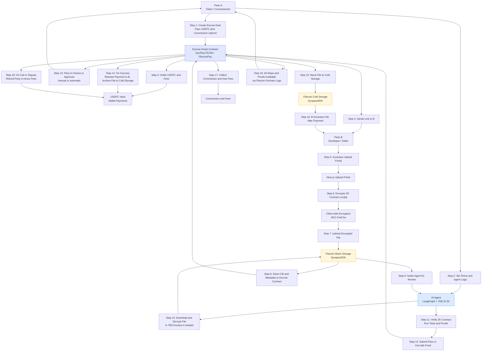

***

# DocPact: A Decentralized, Agent-Driven Trust Layer for Secure Digital Exchange

***

## 🌟 Executive Summary

DocPact is a Filecoin-powered, AI-mediated, and privacy-preserving “digital third party” for secure, verifiable, and flexible digital asset exchange. It lets creators, teams, businesses, and organizations exchange code, designs, keys, media, documents, or any valuable digital content without requiring trust in counterparties or platform operators. With programmable onchain payments, cryptographic storage, agent-verified execution, and full auditability, DocPact brings flexible, open collaboration to the Filecoin Onchain Cloud.

***

## 1. The Trust Crisis in Digital Collaboration

Despite a $16B+ freelance market, explosive growth in remote and knowledge work, and a global creator economy, **online digital collaboration is fraught with risk and unchecked inefficiency**:

- **Rampant Loss & Fraud:** Hundreds of billions are lost yearly to payment fraud, undelivered work, false disputes, and platform lockouts. Freelancers, artists, developers, and clients suffer.
- **High Platform Fees + Rigid, Siloed Workflows:** Upwork, Fiverr, and similar platforms extract 10–20% commission, enforce one-size-fits-all rules, and block cross-process innovation.
- **No Programmatic or Auditable Escrow:** Today, there is *no way* to execute nuanced payment splits, onchain milestone logic, or verifiable, privacy-respecting evidence logs.
- **Broad Opportunities Blocked:** Because of these shortcomings, many digital deals—multi-author work, IP handover, cross-border collaboration, secure document or key exchange, custom royalties, or milestone payouts—are never even attempted.

***

## 2. DocPact: Platform, Protocol, and Trusted Rail

DocPact is **not** just "another freelance site." It’s an agent-driven protocol and full-stack dApp for **secure, programmable, agent-verified execution and settlement** of *any* digital asset or agreement—built for the Onchain Cloud.

### Key Goals

- **Remove blind trust:** Enable strangers or emerging collaborators to transact securely, enforced by cryptography and programmable logic.
- **Power programmable payments:** Instantly support milestone/batch/royalty splits, atomic swaps, partial payouts, and revenue sharing—no platform interference.
- **Anchor every file, proof, contract, and log** on Filecoin with encrypted, modular, and audit-ready storage, leveraging decentralized proof and payment rails.
- **Enable privacy-by-design computation:** Leverage agent plugins, including advanced Zero-Knowledge (ZK) proof support and Trusted Execution Environment (TEE)-backed AI orchestration for any level of verification and confidentiality. *This means even the agent cannot misuse or leak sensitive data during computation.*

***

## 3. Real Use Cases—Beyond Freelance

DocPact revolutionizes trust in *any* digital industry needing verifiable value and programmable payments. Examples include, but are not limited to:

- **Team-based code or design bounties:** Reward split via onchain agent-verification of git commits, doc logs, or test pass rates.
- **High-value art/logo/eBook/media delivery:** Release payment only on agent-verified, format-checked, encrypted handover (e.g., only if watermark, size, and type are correct).
- **Technical content commissioning:** Automated plagiarism, quality, or format scan, with agent/AI approval before payout.
- **Confidential business/IP or key exchange:** Multi-stage, proof-driven asset transfer; keys/proofs released only on milestone/agent-verified satisfaction; guarantees secrecy even during agent execution via enclave/TEE.
- **In-game assets, NFTs, or digital collectibles:** Secure cross-game asset swaps or unlocks on agent or group verification.
- **Social media campaign/content strategy:** Commissions for content schedules, analytics, or influencer posts—deliveries reviewed by AI/agent, payment triggered on proof.
- **Web3/DAO collaboration, audit, or voting:** Multi-sig/group outcomes, bounty payouts, and code audits released only after oracle/agent-verified conditions.
- **Zero-Knowledge (ZK) or TEE-protected verification:** Highly sensitive proofs or business logic executed inside secure enclaves—ensuring neither party nor platform nor agent can leak data, *with onchain attestation/verification*.
- **Co-authored product launches, multi-party licensing:** Staged key reveals or royalty splitting executed via flexible agent contract logic.

#### Additional Use Cases (Illustrative, NOT Exhaustive)

- Secure documentation or manual handover for a startup sale (code, API keys, legal docs)
- Encrypted eBook or training package sales with agent-verified DRM/logic
- Split royalty revenue for ongoing team contributions to digital content/research/IP
- API/paywall access, digital collectible unlocks, personalized content delivery, hackathon bounty management

***

## 4. Under the Hood: How DocPact Works (Technical Walkthrough)

### 4.1 Contract Initiation (A)

Party A (buyer/client) defines the deal in the DocPact Next.js web app. Using conversational or form-based UI powered by **LangGraph agent orchestration**, they specify:

- All deliverables, assets, and formats (code, images, docs, media, keys, or anything else)
- Milestones, splits, payment/release conditions (supports partial delivery, staged payments, group splits)
- One or more verification agents (AI, script, oracle, or human)—*each can be chosen per contract, vertical, or even for deal stages*
- Deadlines, custom fees, optional NDA/encrypted instructions via on-chain metadata

> **Note:** No user account signup is forced—
  - Authentication and transaction signing is handled with **MetaMask**, **WalletConnect**, or similar EVM wallet providers.
  - Web app UI (Next.js, Tailwind CSS) delivers seamless onboarding and clear deal management.

### 4.2 Programmable Payment/Settlement

- User deposits tokens (primarily **USDFC**, with FEVM support) into the **FilecoinPay** escrow smart contract.
- The amount can cover:
  - Transactional payouts (to sellers/contributors)
  - Agent fees (custom per Agent)
  - Protocol fee (flat or %), if chosen
  - Gas & storage buffer
- DocPact (via SynapseSDK's PaymentsService/module) pre-checks balances, handles approvals, and builds a clean onchain summary for all parties.

### 4.3 Submission and Evidence Storage (B)

- Seller/contributor authenticates and uploads deliverables using the DocPact Next.js frontend.
- **All uploads are** AES/ChaCha-encrypted *client-side*; encryption key is generated *per deal*.
- Upload pipeline uses:
  - `@filoz/synapse-sdk/StorageService` :  
    - `createStorage({ withCDN: true })` for fast, warm storage; deal assets and logs later autopushed to cold storage for perpetual access.
  - Each CID (content identifier) and metadata is logged onchain in contract state for agent and audit access.
  - For **large assets** (video, zipped repos), chunked upload + stream processing is supported.

### 4.4 Verifiable AI/Agent Review

- Agents are orchestrated through **LangGraph** (multi-agent, multi-stage orchestration framework for conversational, logic, or workflow agents).
- **AI, script, or human-based agent** (can include multiple nodes in LangGraph) receives a notification, proves identity, and fetches CIDs directly from Filecoin storage via SynapseSDK.
- Using embedded **encryption keys**, agents decrypt files **ONLY in controlled contexts**:
  - For normal flows, decrypt in isolated ephemeral containers (never stored, not accessible to agent developer).
  - For sensitive/critical verification flows—**run inside a Trusted Execution Environment (TEE)/enclave** (e.g., Intel SGX, AWS Nitro, Oasis, Conclave/Consensys):  
    - The TEE attests its hardware status and loaded code on entry, ensuring that *only* the intended verification code runs, not arbitrary/untrusted code.
    - Neither the host system, agent creators, nor anyone else can see in-memory secrets during execution.
    - Outputs are *attested*—recipient can verify TEE (or cloud provider/chain) hardware signature matches expected code hash.
- Agent runs programmable logic (file signature, test suite, watermark, plagiarism/AI check, ZK proof gen or verification, repo content matcher, asset unlock code).
- If using **ZK-proofs**:  
  - Parties can submit or generate ZK proofs within the workflow.  
  - Example: B produces ZK proof that “uploaded file matches some public hash, passes all checks” without revealing file itself.  
  - ZK proofs are verified either by agent plugins, TEE, or, in the future, onchain as ZK rollups mature.

> - **Trusted Execution Environments (TEEs or enclaves)—such as Intel SGX, AWS Nitro, Oasis, Consensys Conclave**—isolate code and data away from host OS/app, providing cryptographic attestation that secret data is only processed inside the tested enclave, and output is only released if computation is unmodified.
> - **DocPact can compose ZK and TEE:** Host ZK proof circuits *inside* TEEs, so that even proof generation is never seen by the agent’s host or network, for “defense-in-depth”.

### 4.5 Payment, Disclosure, and Handover

- On agent or ZK/TEE-verified pass, the DocPact smart contract releases USDFC (via FilecoinPay or Synapse PaymentsService) to B, per contract stipulations (full, split, or staged as defined in contract/milestone logic).
- If present, the deal-specific decryption key is released to client (A); all deliverables become accessible and verifiable.
- Failure/dispute/agent or attestation failure results in protocol-triggered refund, return-to-draft, burn, or optional mediation. *All steps are logged on Filecoin for full, cryptographic audit and replay.*

### 4.6 Secure, Auditable Storage and Privacy

- **Every file, log, and contract event is pushed to Filecoin via Synapse SDK**, using decentralized proofs, audit trails, and content-addressed storage.
- Blockchain event logs + offchain Merkle proofs anchor every workflow; *no lost evidence or “he said, she said”—all deal artifacts verifiable anytime*.
- **Client-driven encryption** always, with one-time or agent/TEE-scoped decryption—**no agent or storage provider ever sees confidential data unless contracted and attested for that session**.

### 4.7 Detailed Integration & Full Stack — Packages, SDKs, and Agent Architecture

**Front End & Back End:**  
- `next`, `react`, `typescript`, and `tailwindcss`: Unified SSR/CSR dApp for onboarding, dashboards, API routes (private/public endpoints), agent triggers, admin interfaces.
- All API flows (deal creation, file upload, agent triggers, key disclosures) orchestrated with Next.js serverless endpoints for security and performance.

**Agent Orchestration:**  
- `langgraph`: All DocPact agent code/automation runs as composable graphs—handle multi-node, multi-stage, and conditional flows; supports agent-to-agent, agent AI to human review, and agent to TEE/Conclave.
- Pluggable module support for ZK-proof checkers, TEE/conclave calls, and oracle integrations.
- AI API calls (optional): Allow decentralized/3rd party LLM APIs (e.g., Bittensor, Gensyn) for advanced content evaluation (run in ephemeral or TEE-protected env).

**Filecoin/Onchain Cloud:**  
- `@filoz/synapse-sdk` (StorageService, PaymentsService, Pandora/PDP, CommP utilities): Everything from encrypted upload to retrieval, programmable cost estimation, and modular payment flows.
- All Filecoin/FEVM interactions (wallet auth, payment/approval, contract agent triggers, event logging) using EVM-compatible tools.
- `filecoinpay` contract libraries for onchain USDFC escrow, payout, and refund.

**Encryption, Key, and Privacy:**  
- `crypto`, `webcrypto`, `libsodium`, or `tweetnacl` for client-side AES/ChaCha encryption.
- Optional browser fingerprinting and deal-specific entropy salts for per-session secrets.

**Confidential/Enclave Verification:**  
- Enclave/TEE SDKs e.g., `node-sgx`, `@consensys/conclave-client`, or cloud TEEs (Azure Confidential Ledger, AWS Nitro, Oasis, etc.)
- For ZK, proof circuits can be generated with `circom`, `snarkjs` or (future) Noir for agent/contract hybrid verification.

**Testing + CI/CD:**  
- `jest`, `playwright` for end-to-end, workflow, and UI tests.
- `testcontainers` for staging multi-agent, multi-contract testnets.

***

## 5. System Diagram

***

## 6. Why Filecoin Onchain Cloud?

- **Scalable, programmable, content-addressed storage**—pay-by-use and always permanent.
- **Flexible USDFC-based programmable payments/escrow** with programmable splits and agent triggers.
- **Decentralized proof and retrieval**—all deal evidence and events are cryptographically proven, never lost, and not tropical to platform infra.
- **Native support for ZK/TEE computation**—run verifications confidentially, trustlessly, and extensibly.

***

## 7. Market Impact & Modularity

**DocPact’s design meets:**
- Freelancers, teams, and DAOs seeking freedom from 20%+ platform fees, rigid templates, or payment risk.
- Creators, business users, and researchers needing programmable, trust-minimized, and privacy-safe digital contract rails.
- Global organizations craving open sourcing, royalty splits, IP handovers, or multi-party revenue—without central bottlenecks.

**Initial GTM:**  
- Developer and creator pilot programs—hackathons, open bounties, early-adopter DAOs
- Open agent/template marketplace—rewarding agent creators and power users
- Community onboarding—extensible UI, plugin, and analytics support

***

## 8. Extensibility & Future Vision

- **Agent/plugin marketplace:** Devs and users add new agents, ZK/TEE flows, social/vertical templates, composable for new industries
- **Template library:** Flexibly supports new use cases, team splits, legal flows, patent sales, digital credentials, voting, and more
- **Web3 status:** Modular, EVM-sidecar ready, can be integrated with NFTs, DAOs, credentialing, and open science/research
- **Analytics, governance, open reputation:** Every actor, agent, and template can accrue both open and private trust/reputation, supporting compound and open-benefit network effects

***

## 9. Invitation & Next Steps

DocPact is built as a transparent, community-owned trust protocol:
- **Developers:** Contribute agent modules, plugins, workflow templates, or integration layers.
- **Early users:** Give feedback, help pilot; shape next-gen trust rails.
- **Researchers/partners:** Collaborate on ZK/TEE circuits, privacy-preserving computation, and innovative onchain verification templates.

**Ready for even deeper technical dives, code snippets, API docs, or deployment runbooks? Visit our GitHub [insert link] and jump in!**

***

**DocPact is the programmable, reliable, decentralized agent for digital value exchange. Powered by Filecoin, extensible by design, and robust enough to power the digital work, knowledge, and creativity of tomorrow.**

***